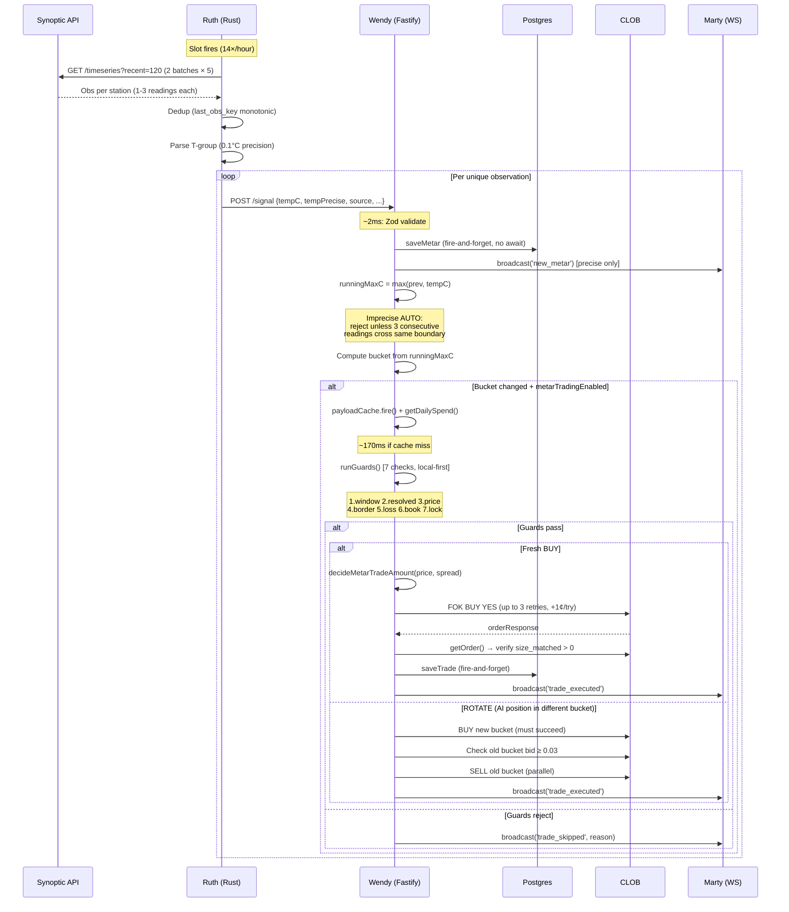
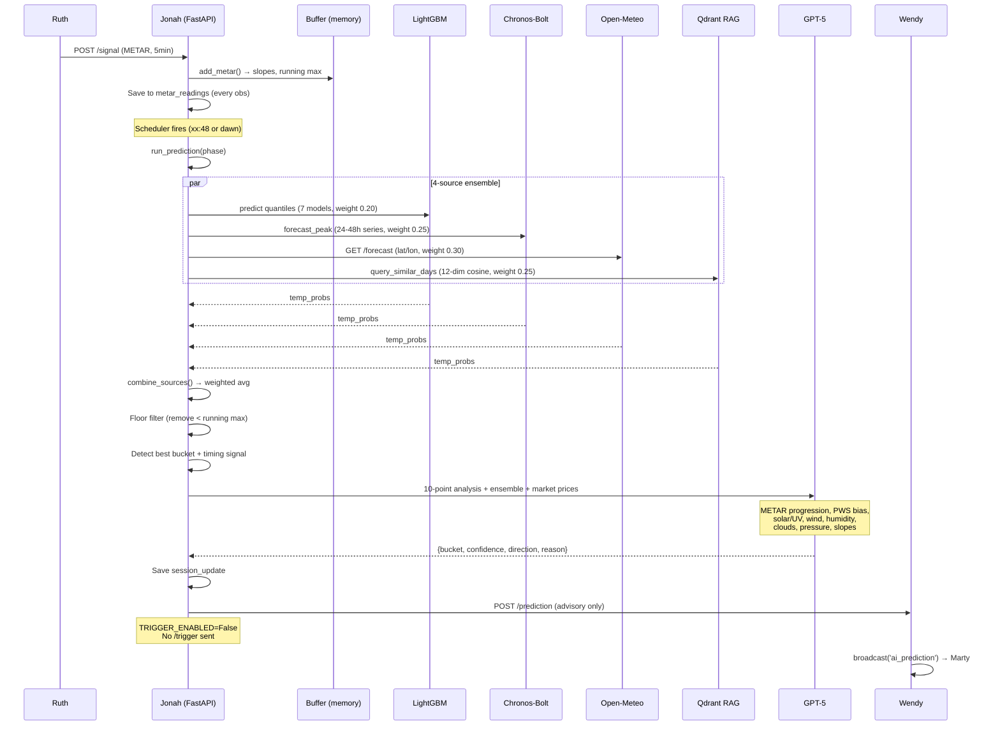
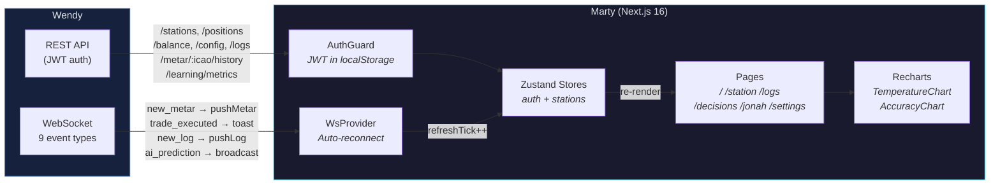
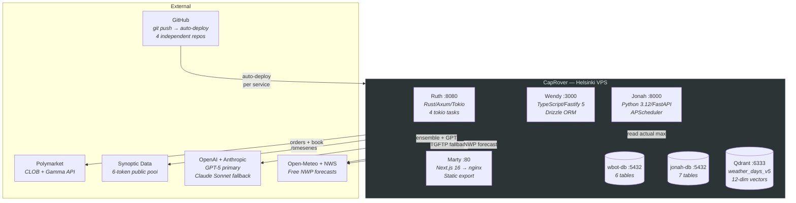

# Wozark — Architecture (from code, 2026-04-16)

## System Overview

```mermaid
graph TB
    subgraph External["External APIs"]
        SYN["Synoptic Data<br/><i>/timeseries?recent=120</i><br/><i>6-token rotation pool</i>"]
        TGFTP["TGFTP (NOAA)<br/><i>Static .TXT per ICAO</i><br/><i>Parallel on :51/:53</i>"]
        WU["Weather Underground<br/><i>PWS API — 3 IDs/station</i>"]
        GAMMA["Gamma API<br/><i>Market events + prices</i><br/><i>5min cache, 2min bg refresh</i>"]
        CLOB["Polymarket CLOB<br/><i>FOK/GTC orders + EIP-712</i><br/><i>Book snapshots (30s cache)</i>"]
        OMET["Open-Meteo<br/><i>Free NWP forecast</i><br/><i>weight: 0.30</i>"]
        GPT5["OpenAI GPT-5<br/><i>Final decision-maker</i><br/><i>Claude Sonnet fallback</i>"]
        NWS["NWS<br/><i>Grid forecasts + AFD</i>"]
    end

    subgraph CapRover["CapRover — Helsinki VPS"]
        direction TB

        subgraph Ruth["Ruth (Rust/Axum) :8080"]
            R_SCHED["Slot Scheduler<br/><i>[:00,:05,...,:50,:51,:53,:55]</i><br/><i>14 polls/hour</i>"]
            R_SYN["Synoptic Client<br/><i>Batch 5 stations × 2</i><br/><i>Per-station retry 3×</i>"]
            R_TGFTP["TGFTP Client<br/><i>Fallback + parallel :51/:53</i>"]
            R_HOT["Hot-Poll Window<br/><i>:50-:58 @ 3s interval</i><br/><i>T-group precision capture</i>"]
            R_PWS["PWS Poller<br/><i>Weather Underground</i><br/><i>5min → Jonah only</i>"]
            R_SEND["Sender<br/><i>Circuit breaker (10 fails)</i><br/><i>Retry buffer (200 items)</i>"]
            R_DEDUP["Dedup<br/><i>last_obs_key HashMap</i><br/><i>Cold-start filter</i>"]
        end

        subgraph Wendy["Wendy (TypeScript/Fastify) :3000"]
            W_SIG["POST /signal<br/><i>Zod validation</i>"]
            W_PROC["processMetar<br/><i>runningMaxC (monotonic)</i><br/><i>Imprecise AUTO gating</i><br/><i>Sustained 3-read filter</i>"]
            W_GUARD["Guards (ordered)<br/><i>1.window 2.resolved 3.price</i><br/><i>4.border 5.loss 6.book 7.lock</i>"]
            W_BUY["BuyService<br/><i>FOK → 3 retries (+1¢/try)</i><br/><i>Verify size_matched</i>"]
            W_SELL["SellService<br/><i>FOK, floor shares 0.01</i>"]
            W_ROT["RotateService<br/><i>BUY new first</i><br/><i>Then SELL old (parallel)</i>"]
            W_MON["Monitor (3min tick)<br/><i>Auto-sell @ 99¢</i><br/><i>Duplicate detection</i><br/><i>Sell retry queue</i><br/><i>Price refresh</i>"]
            W_PRED["POST /prediction<br/><i>Advisory broadcast</i>"]
            W_WS["WS Broadcaster<br/><i>9 events: new_metar,</i><br/><i>trade_executed, ai_prediction...</i>"]
            W_CACHE["Payload Cache<br/><i>30min reload</i><br/><i>Pre-built order metadata</i>"]
            W_SHADOW["Shadow Module<br/><i>SHADOW_MODE=true</i><br/><i>15-day parallel simulator</i>"]
            WDB[("Postgres wbot_prod<br/><i>metar_observations</i><br/><i>trades, logs, app_config</i><br/><i>jonah_triggers, auth_sessions</i>")]
        end

        subgraph Jonah["Jonah (Python/FastAPI) :8000  — LEARNING ONLY"]
            J_SIG["POST /signal<br/><i>Buffer + DB save</i><br/><i>Dedup by obs_time</i>"]
            J_BUF["Buffer (in-memory)<br/><i>Per-station METAR+PWS</i><br/><i>Slopes, running max</i><br/><i>Snapshot every 2min</i>"]
            J_ENS["4-Source Ensemble<br/><i>LightGBM (0.20)</i><br/><i>Chronos-Bolt (0.25)</i><br/><i>Open-Meteo (0.30)</i><br/><i>RAG/Qdrant (0.25)</i>"]
            J_GPT["GPT-5 Decision<br/><i>10-point analysis</i><br/><i>Claude Sonnet fallback</i>"]
            J_SCHED["Scheduler<br/><i>station_check (5min)</i><br/><i>hourly_cycle (xx:48)</i><br/><i>learning (10 UTC)</i><br/><i>overnight_scan (08 UTC)</i>"]
            J_LEARN["Learning Pipeline<br/><i>Resolve outcomes nightly</i><br/><i>→ Qdrant + learning_outcomes</i>"]
            J_PROXY["Proxy<br/><i>TRIGGER_ENABLED=False</i><br/><i>/prediction only (advisory)</i>"]
            JDB[("Postgres jonah_prod<br/><i>metar_readings, pws_readings</i><br/><i>day_sessions, session_updates</i><br/><i>learning_outcomes</i>")]
            JQ[("Qdrant :6333<br/><i>weather_days_v5</i><br/><i>12-dim cosine search</i>")]
        end

        subgraph Marty["Marty (Next.js 16/React 19) :80"]
            M_HOME["/ Home<br/><i>Portfolio + Station Grid (5 col)</i>"]
            M_STATION["/station/[icao]<br/><i>Temp chart + NOW + METAR</i><br/><i>Positions + Logs</i>"]
            M_LOGS["/logs<br/><i>Live feed + filters</i>"]
            M_DEC["/decisions<br/><i>BUY/SELL/ROTATE/SKIP history</i>"]
            M_JONAH["/jonah<br/><i>Accuracy charts + sources</i>"]
            M_SET["/settings<br/><i>Config + station toggles</i>"]
            M_WS["WS Client<br/><i>Zustand store</i><br/><i>refreshTick → re-fetch</i><br/><i>60s fallback poll</i>"]
            M_AUTH["JWT Auth<br/><i>localStorage token</i>"]
        end
    end

    %% Ruth → External
    SYN -->|"sensor data<br/>2 batches × 5 stations"| R_SYN
    TGFTP -.->|"fallback + parallel<br/>:51/:53 + hot-poll"| R_TGFTP
    WU -->|"PWS readings<br/>3 IDs/station"| R_PWS

    %% Ruth internal
    R_SCHED --> R_SYN
    R_SCHED -->|":51,:53"| R_TGFTP
    R_SYN --> R_DEDUP
    R_TGFTP --> R_DEDUP
    R_HOT --> R_SYN
    R_HOT --> R_TGFTP
    R_DEDUP --> R_SEND

    %% Ruth → Wendy/Jonah
    R_SEND -->|"POST /signal<br/>circuit breaker"| W_SIG
    R_SEND -->|"POST /signal<br/>fire-and-forget + 1 retry"| J_SIG
    R_PWS -->|"POST /signal (PWS)<br/>Jonah only"| J_SIG

    %% Wendy signal flow
    W_SIG --> W_PROC
    W_PROC -->|"bucket crossing"| W_GUARD
    W_GUARD -->|"guards pass"| W_BUY
    W_GUARD -->|"ROTATE detected"| W_ROT
    W_BUY -->|"FOK/GTC"| CLOB
    W_ROT -->|"BUY new → SELL old"| CLOB
    W_SELL -->|"FOK"| CLOB
    W_PROC -->|"broadcast"| W_WS
    W_CACHE --> GAMMA
    CLOB -->|"verify size_matched"| W_BUY

    %% Wendy DB
    W_PROC -->|"fire-and-forget"| WDB
    W_BUY -->|"save trade"| WDB
    W_MON --> WDB

    %% Jonah pipeline
    J_SIG --> J_BUF
    J_SIG -->|"save every reading"| JDB
    J_BUF --> J_ENS
    J_SCHED --> J_ENS
    J_ENS --> J_GPT
    J_GPT --> J_PROXY
    J_PROXY -->|"POST /prediction<br/>advisory only"| W_PRED
    J_LEARN -->|"resolve + store"| JQ
    J_LEARN -->|"fetch actual max"| WDB
    J_LEARN -->|"store outcomes"| JDB

    %% Jonah → External
    J_ENS -->|"weight 0.30"| OMET
    J_ENS -->|"weight 0.25"| JQ
    J_GPT --> GPT5
    J_GPT -.->|"fallback"| GPT5
    J_SCHED -->|"NWS context"| NWS

    %% Wendy → Marty
    W_PRED --> W_WS
    W_WS -->|"WebSocket<br/>9 event types"| M_WS
    Marty -->|"REST (JWT)<br/>/stations, /positions,<br/>/balance, /config, /logs"| Wendy

    %% Styling
    classDef external fill:#4a4a4a,stroke:#666,color:#fff
    classDef rust fill:#ce422b,stroke:#a33,color:#fff
    classDef ts fill:#3178c6,stroke:#256,color:#fff
    classDef python fill:#3776ab,stroke:#256,color:#fff
    classDef react fill:#61dafb,stroke:#49b,color:#000
    classDef db fill:#336791,stroke:#245,color:#fff
    classDef ai fill:#10a37f,stroke:#0a7d5a,color:#fff

    class SYN,TGFTP,WU,GAMMA,CLOB,OMET,NWS external
    class GPT5 ai
    class R_SCHED,R_SYN,R_TGFTP,R_HOT,R_PWS,R_SEND,R_DEDUP rust
    class W_SIG,W_PROC,W_GUARD,W_BUY,W_SELL,W_ROT,W_MON,W_PRED,W_WS,W_CACHE,W_SHADOW ts
    class J_SIG,J_BUF,J_ENS,J_GPT,J_SCHED,J_LEARN,J_PROXY python
    class M_HOME,M_STATION,M_LOGS,M_DEC,M_JONAH,M_SET,M_WS,M_AUTH react
    class WDB,JDB,JQ db
```

## Signal Hot Path (150-400ms)

```mermaid
sequenceDiagram
    participant SYN as Synoptic API
    participant R as Ruth (Rust)
    participant W as Wendy (Fastify)
    participant DB as Postgres
    participant C as CLOB
    participant M as Marty (WS)

    Note over R: Slot fires (14×/hour)
    R->>SYN: GET /timeseries?recent=120 (2 batches × 5)
    SYN-->>R: Obs per station (1-3 readings each)
    R->>R: Dedup (last_obs_key monotonic)
    R->>R: Parse T-group (0.1°C precision)

    loop Per unique observation
        R->>W: POST /signal {tempC, tempPrecise, source, ...}
        Note over W: ~2ms: Zod validate

        W->>DB: saveMetar (fire-and-forget, no await)
        W->>M: broadcast('new_metar') [precise only]

        W->>W: runningMaxC = max(prev, tempC)
        Note over W: Imprecise AUTO:<br/>reject unless 3 consecutive<br/>readings cross same boundary

        W->>W: Compute bucket from runningMaxC

        alt Bucket changed + metarTradingEnabled
            W->>W: payloadCache.fire() + getDailySpend()
            Note over W: ~170ms if cache miss

            W->>W: runGuards() [7 checks, local-first]
            Note over W: 1.window 2.resolved 3.price<br/>4.border 5.loss 6.book 7.lock

            alt Guards pass
                alt Fresh BUY
                    W->>W: decideMetarTradeAmount(price, spread)
                    W->>C: FOK BUY YES (up to 3 retries, +1¢/try)
                    C-->>W: orderResponse
                    W->>C: getOrder() → verify size_matched > 0
                    W->>DB: saveTrade (fire-and-forget)
                    W->>M: broadcast('trade_executed')
                else ROTATE (AI position in different bucket)
                    W->>C: BUY new bucket (must succeed)
                    W->>C: Check old bucket bid ≥ 0.03
                    W->>C: SELL old bucket (parallel)
                    W->>M: broadcast('trade_executed')
                end
            else Guards reject
                W->>M: broadcast('trade_skipped', reason)
            end
        end
    end
```

## Jonah Prediction Pipeline

```mermaid
sequenceDiagram
    participant R as Ruth
    participant J as Jonah (FastAPI)
    participant BUF as Buffer (memory)
    participant LGB as LightGBM
    participant CHR as Chronos-Bolt
    participant OM as Open-Meteo
    participant QD as Qdrant RAG
    participant GPT as GPT-5
    participant W as Wendy

    R->>J: POST /signal (METAR, 5min)
    J->>BUF: add_metar() → slopes, running max
    J->>J: Save to metar_readings (every obs)

    Note over J: Scheduler fires (xx:48 or dawn)
    J->>J: run_prediction(phase)

    par 4-source ensemble
        J->>LGB: predict quantiles (7 models, weight 0.20)
        J->>CHR: forecast_peak (24-48h series, weight 0.25)
        J->>OM: GET /forecast (lat/lon, weight 0.30)
        J->>QD: query_similar_days (12-dim cosine, weight 0.25)
    end

    LGB-->>J: temp_probs
    CHR-->>J: temp_probs
    OM-->>J: temp_probs
    QD-->>J: temp_probs

    J->>J: combine_sources() → weighted avg
    J->>J: Floor filter (remove < running max)
    J->>J: Detect best bucket + timing signal

    J->>GPT: 10-point analysis + ensemble + market prices
    Note over GPT: METAR progression, PWS bias,<br/>solar/UV, wind, humidity,<br/>clouds, pressure, slopes
    GPT-->>J: {bucket, confidence, direction, reason}

    J->>J: Save session_update
    J->>W: POST /prediction (advisory only)
    Note over J: TRIGGER_ENABLED=False<br/>No /trigger sent
    W->>W: broadcast('ai_prediction') → Marty
```

## Marty Data Flow

```mermaid
graph LR
    subgraph Wendy
        API["REST API<br/>(JWT auth)"]
        WS["WebSocket<br/>9 event types"]
    end

    subgraph Marty["Marty (Next.js 16)"]
        direction TB
        AUTH["AuthGuard<br/><i>JWT in localStorage</i>"]
        STORE["Zustand Stores<br/><i>auth + stations</i>"]
        WSPROV["WsProvider<br/><i>Auto-reconnect</i>"]
        PAGES["Pages<br/><i>/ /station /logs</i><br/><i>/decisions /jonah /settings</i>"]
        CHARTS["Recharts<br/><i>TemperatureChart</i><br/><i>AccuracyChart</i>"]
    end

    API -->|"/stations, /positions<br/>/balance, /config, /logs<br/>/metar/:icao/history<br/>/learning/metrics"| AUTH
    WS -->|"new_metar → pushMetar<br/>trade_executed → toast<br/>new_log → pushLog<br/>ai_prediction → broadcast"| WSPROV

    AUTH --> STORE
    WSPROV -->|"refreshTick++"| STORE
    STORE -->|"re-render"| PAGES
    PAGES --> CHARTS

    style Marty fill:#1a1a2e,stroke:#61dafb,color:#dfe6e9
    style Wendy fill:#16213e,stroke:#3178c6,color:#dfe6e9
```

## Infrastructure

```mermaid
graph TB
    subgraph Helsinki["CapRover — Helsinki VPS"]
        R["Ruth :8080<br/><i>Rust/Axum/Tokio</i><br/><i>4 tokio tasks</i>"]
        W["Wendy :3000<br/><i>TypeScript/Fastify 5</i><br/><i>Drizzle ORM</i>"]
        J["Jonah :8000<br/><i>Python 3.12/FastAPI</i><br/><i>APScheduler</i>"]
        M["Marty :80<br/><i>Next.js 16 → nginx</i><br/><i>Static export</i>"]
        PG1[("wbot-db :5432<br/><i>6 tables</i>")]
        PG2[("jonah-db :5432<br/><i>7 tables</i>")]
        QD[("Qdrant :6333<br/><i>weather_days_v5</i><br/><i>12-dim vectors</i>")]
    end

    subgraph External
        GH["GitHub<br/><i>git push → auto-deploy</i><br/><i>4 independent repos</i>"]
        PM["Polymarket<br/><i>CLOB + Gamma API</i>"]
        SYN["Synoptic Data<br/><i>6-token public pool</i>"]
        AI["OpenAI + Anthropic<br/><i>GPT-5 primary</i><br/><i>Claude Sonnet fallback</i>"]
        WEATHER["Open-Meteo + NWS<br/><i>Free NWP forecasts</i>"]
    end

    GH -->|"auto-deploy<br/>per service"| Helsinki
    R -->|"/timeseries"| SYN
    R -->|"TGFTP fallback"| WEATHER
    W -->|"orders + book"| PM
    W --> PG1
    J --> PG2
    J --> QD
    J -->|"ensemble + GPT"| AI
    J -->|"NWP forecast"| WEATHER
    J -.->|"read actual max"| PG1

    style Helsinki fill:#2d3436,stroke:#636e72,color:#dfe6e9
```
