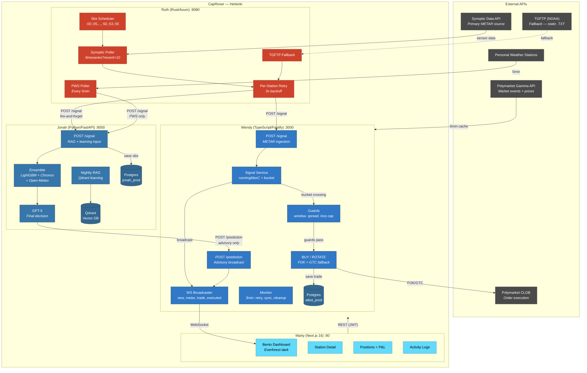
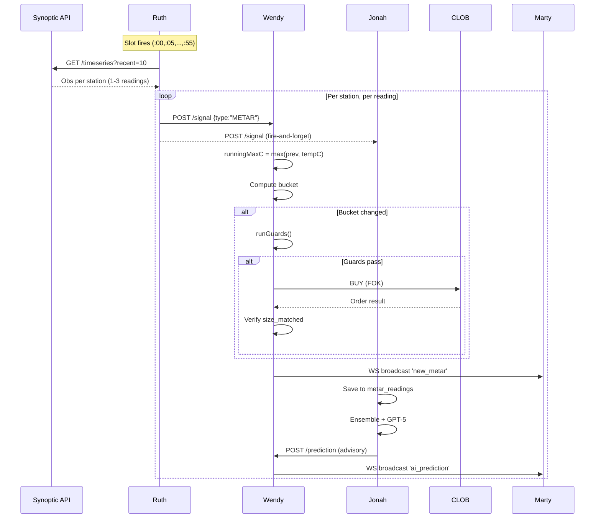
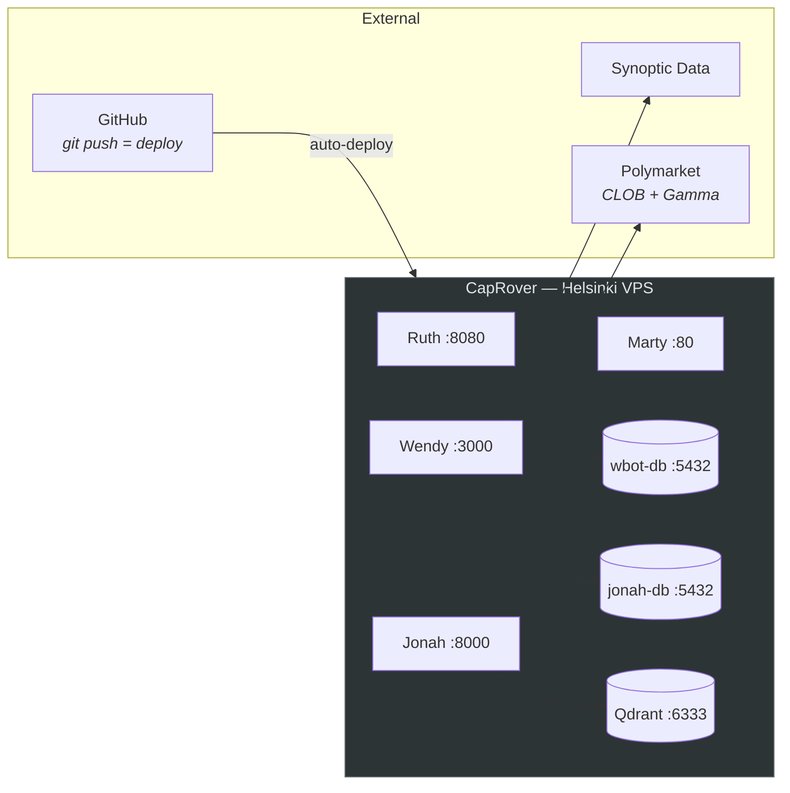

# Wozark — Architecture Diagram

## System Overview

```mermaid
graph TB
    subgraph External["External APIs"]
        SYN["Synoptic Data API<br/><i>Primary METAR source</i>"]
        TGFTP["TGFTP (NOAA)<br/><i>Fallback — static .TXT</i>"]
        PWS["Personal Weather Stations"]
        GAMMA["Polymarket Gamma API<br/><i>Market events + prices</i>"]
        CLOB["Polymarket CLOB<br/><i>Order execution</i>"]
    end

    subgraph CapRover["CapRover — Helsinki"]
        direction TB

        subgraph Ruth["Ruth (Rust/Axum) :8080"]
            R1["Slot Scheduler<br/><i>:00,:05,...,:50,:53,:55</i>"]
            R2["Synoptic Poller<br/><i>/timeseries?recent=10</i>"]
            R3["TGFTP Fallback"]
            R4["PWS Poller<br/><i>Every 5min</i>"]
            R5["Per-Station Retry<br/><i>3x backoff</i>"]
        end

        subgraph Wendy["Wendy (TypeScript/Fastify) :3000"]
            W1["POST /signal<br/><i>METAR ingestion</i>"]
            W2["Signal Service<br/><i>runningMaxC + bucket</i>"]
            W3["Guards<br/><i>window, spread, loss cap</i>"]
            W4["BUY / ROTATE<br/><i>FOK + GTC fallback</i>"]
            W5["POST /prediction<br/><i>Advisory broadcast</i>"]
            W6["WS Broadcaster<br/><i>new_metar, trade_executed</i>"]
            W7["Monitor<br/><i>3min: retry, sync, cleanup</i>"]
            WDB[(Postgres<br/>wbot_prod)]
        end

        subgraph Jonah["Jonah (Python/FastAPI) :8000"]
            J1["POST /signal<br/><i>RAG + learning input</i>"]
            J2["Ensemble<br/><i>LightGBM + Chronos<br/>+ Open-Meteo</i>"]
            J3["GPT-5<br/><i>Final decision</i>"]
            J4["Nightly RAG<br/><i>Qdrant learning</i>"]
            JDB[(Postgres<br/>jonah_prod)]
            JQ[(Qdrant<br/>Vector DB)]
        end

        subgraph Marty["Marty (Next.js 16) :80"]
            M1["Bento Dashboard<br/><i>Everforest dark</i>"]
            M2["Station Detail"]
            M3["Positions + P&L"]
            M4["Activity Logs"]
        end
    end

    %% Data flow
    SYN -->|"sensor data"| R2
    TGFTP -.->|"fallback"| R3
    PWS -->|"5min"| R4

    R1 --> R2
    R2 --> R5
    R3 --> R5

    R5 -->|"POST /signal"| W1
    R5 -->|"POST /signal<br/><i>fire-and-forget</i>"| J1
    R4 -->|"POST /signal<br/><i>PWS only</i>"| J1

    W1 --> W2
    W2 -->|"bucket crossing"| W3
    W3 -->|"guards pass"| W4
    W4 -->|"FOK/GTC"| CLOB
    W4 -->|"save trade"| WDB
    W2 -->|"broadcast"| W6

    GAMMA -->|"5min cache"| Wendy

    J1 --> J2
    J2 --> J3
    J3 -->|"POST /prediction<br/><i>advisory only</i>"| W5
    J1 -->|"save obs"| JDB
    J4 --> JQ

    W5 --> W6
    W6 -->|"WebSocket"| M1

    Marty -->|"REST (JWT)"| Wendy

    %% Styling
    classDef external fill:#4a4a4a,stroke:#666,color:#fff
    classDef rust fill:#ce422b,stroke:#a33,color:#fff
    classDef ts fill:#3178c6,stroke:#256,color:#fff
    classDef python fill:#3776ab,stroke:#256,color:#fff
    classDef react fill:#61dafb,stroke:#49b,color:#000
    classDef db fill:#336791,stroke:#245,color:#fff

    class SYN,TGFTP,PWS,GAMMA,CLOB external
    class R1,R2,R3,R4,R5 rust
    class W1,W2,W3,W4,W5,W6,W7 ts
    class J1,J2,J3,J4 python
    class M1,M2,M3,M4 react
    class WDB,JDB,JQ db
```

## Data Flow — Signal Hot Path

```mermaid
sequenceDiagram
    participant SYN as Synoptic API
    participant R as Ruth
    participant W as Wendy
    participant J as Jonah
    participant C as CLOB
    participant M as Marty

    Note over R: Slot fires (:00,:05,...,:55)
    R->>SYN: GET /timeseries?recent=10
    SYN-->>R: Obs per station (1-3 readings)

    loop Per station, per reading
        R->>W: POST /signal {type:"METAR"}
        R-->>J: POST /signal (fire-and-forget)

        W->>W: runningMaxC = max(prev, tempC)
        W->>W: Compute bucket

        alt Bucket changed
            W->>W: runGuards()
            alt Guards pass
                W->>C: BUY (FOK)
                C-->>W: Order result
                W->>W: Verify size_matched
            end
        end

        W->>M: WS broadcast 'new_metar'

        J->>J: Save to metar_readings
        J->>J: Ensemble + GPT-5
        J->>W: POST /prediction (advisory)
        W->>M: WS broadcast 'ai_prediction'
    end
```

## Infrastructure

```mermaid
graph LR
    subgraph Helsinki["CapRover — Helsinki VPS"]
        R["Ruth :8080"]
        W["Wendy :3000"]
        J["Jonah :8000"]
        M["Marty :80"]
        PG1[(wbot-db :5432)]
        PG2[(jonah-db :5432)]
        QD[(Qdrant :6333)]
    end

    subgraph External
        GH["GitHub<br/><i>git push = deploy</i>"]
        PM["Polymarket<br/><i>CLOB + Gamma</i>"]
        SYN["Synoptic Data"]
    end

    GH -->|"auto-deploy"| Helsinki
    R --> SYN
    W --> PM
    W --> PG1
    J --> PG2
    J --> QD

    style Helsinki fill:#2d3436,stroke:#636e72,color:#dfe6e9
```
